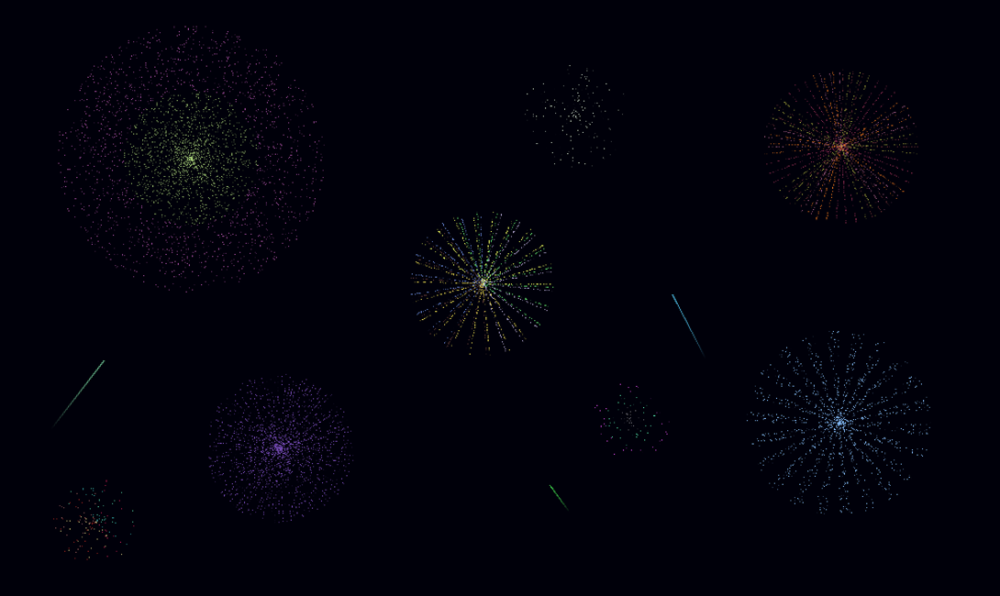

# Firework-Sim
Firework simulator is C++ based basic graphic firework simulator. Program provides fireworks of various size, shape, coloring, lifetime and many other properties. Simply click on the screen to launch a random firework.

  </img>

