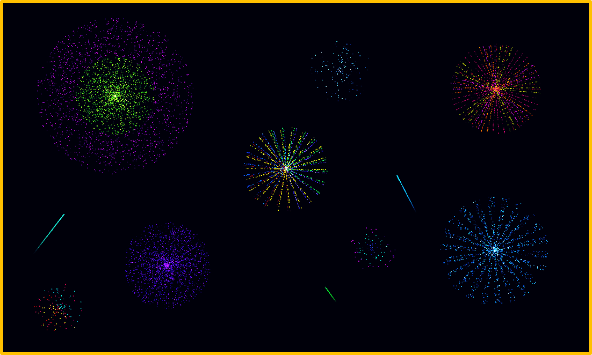

# Firework-Sim
Firework simulator is C++ based basic graphic firework simulator. Program provides fireworks of various size, shape, coloring, lifetime and many other properties. Simply click on the screen to launch a random firework.

<p align="center">
  </img>
</p>


## Prerequisites
The program was developed in [C++14](https://en.cppreference.com/w/cpp/14). Additionally, the [SFML](https://www.sfml-dev.org/) library was used for graphics and audio.


## Getting Started
To run the program, download and unzip [Firework-Sim.zip](Firework-Sim.zip). You should expect the directory below:

```
+-- Firework-Sim
|   +-- Firework Simulator.lnk
|   +-- App
|   |   +-- assets
|   |   +-- Fireworks.cbp
|   |   +-- Fireworks.exe
|   |   +-- sfml-audio-2.dll
|   |   +-- sfml-graphics-2.dll
|   |   +-- ...
```

Running the **Firework Simulator** shortcut should be enough to access the program. Alternatively the **Fireworks.exe** could be run.


## Used Modules
- *main.ccp* - main function launching the app
- *fireworkApp.hpp*, *fireworkApp.ccp* - firework app
- *launcher.hpp*, *launcher.ccp* - firework launcher
- *firework.hhp*, *firework.ccp* - firework explosion
- *physics.hhp*, *physics.ccp* - firework physics and randomness
- *designer.hpp*, *designer.ccp* - custom firework designer, parameter variation


## Future Improvements
Project could be improved in following directions:
- **More Diverse Fireworks** - there are many firework designs that could be added to the simulator
- **Better Physics** - project supports only basic physics (air friction, gravity, fade), which could be improved
- **Better Audio** - currently launch and explosion are simply single audio files randomized by changing pitch


## Details
- Author - Arastun Mammadli
- License - [MIT](LICENSE)
